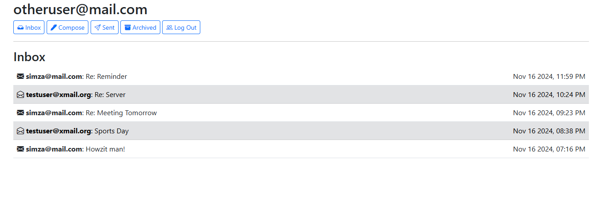
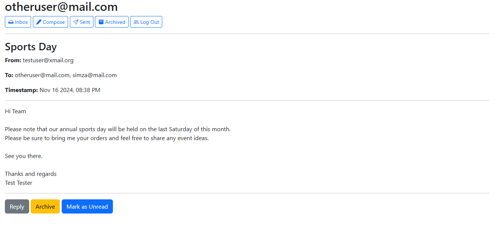
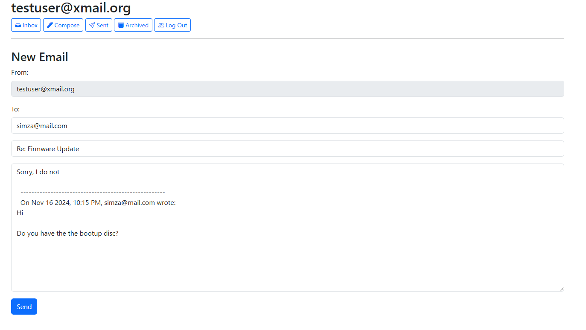

# Email Client Project

This project is a single-page email client implemented using **Django**, **JavaScript**, **HTML**, and **Bootstrap**. The application allows users to send emails, view mailboxes (Inbox, Sent, and Archive), and perform actions like reading, archiving, unarchiving, and replying to emails. The backend logic and API endpoints are built using Django, while the frontend is implemented in JavaScript. 

---

## Features

### 1. **Send Mail**
- Users can compose and send emails using the email composition form.
- A `POST` request is made to `/emails` with the following fields:
  - `recipients`
  - `subject`
  - `body`
- Once an email is sent, the user is redirected to their Sent mailbox.

### 2. **Mailbox Management**
- Users can view their **Inbox**, **Sent**, and **Archive** mailboxes.
- When a mailbox is visited:
  - A `GET` request is made to `/emails/<mailbox>` to fetch the latest emails.
  - The mailbox name is displayed at the top of the page.
  - Emails are displayed in individual boxes, showing:
    - Sender
    - Subject line
    - Timestamp
  - Emails appear with:
    - White background if unread.
    - Gray background if read.



### 3. **View Email**
- Users can click on an email to view its content.
- A `GET` request is made to `/emails/<email_id>` to fetch the email details.
- The email view displays:
  - Sender
  - Recipients
  - Subject
  - Timestamp
  - Body
- Emails are marked as read once viewed (via a `PUT` request).
- Appropriate views are dynamically shown and hidden as needed.



### 4. **Archive and Unarchive**
- Users can:
  - Archive emails from the Inbox.
  - Unarchive emails from the Archive mailbox.
- Archiving and unarchiving actions are performed via a `PUT` request to `/emails/<email_id>`.
- Once an email is archived or unarchived, the user is redirected to the Inbox.

### 5. **Reply**
- Users can reply to an email.
- Clicking the "Reply" button:
  - Opens the email composition form.
  - Pre-fills the form with:
    - **Recipient:** Set to the sender of the original email.
    - **Subject:** Preceded with `Re: ` unless it already begins with `Re:`.
    - **Body:** Reply body prefilled with previous email and timestamp



---


## How to Run the Project
1. Clone the repository:
   ```bash
   git clone https://github.com/simminda/mail.git
   ```
2. Navigate to the project directory:
   ```bash
   cd mail
   ```
3. Install dependencies:
   ```bash
   pip install -r requirements.txt
   ```
4. Apply database migrations:
   ```bash
   python manage.py migrate
   ```
5. Start the development server:
   ```bash
   python manage.py runserver
   ```
6. Open the application in your web browser at `http://127.0.0.1:8000/`.

---

## API Endpoints

- **Send Email:**
  ```
  POST /emails
  ```
  **Parameters:** `recipients`, `subject`, `body`

- **Fetch Mailbox:**
  ```
  GET /emails/<mailbox>
  ```

- **Fetch Email Details:**
  ```
  GET /emails/<email_id>
  ```

- **Mark Email as Read/Unread:**
  ```
  PUT /emails/<email_id>
  ```
  **Parameters:** `read`

- **Archive/Unarchive Email:**
  ```
  PUT /emails/<email_id>
  ```
  **Parameters:** `archived`

---

## Project Requirements
- **Languages and Frameworks Used:**
  - Python (Django)
  - JavaScript
  - HTML
  - CSS
- **Primary Files:**
  - Backend: `views.py`, `models.py`, `urls.py`
  - Frontend: `inbox.js`
- **Dynamic Views:** The application dynamically shows and hides different sections of the page (e.g., Inbox, Compose Email, View Email).

---

## Future Enhancements
- Add search functionality to filter emails by sender or subject.
- Implement sorting options (e.g., by date or sender).

---

## License
This project is open-source and available under the [MIT License](LICENSE).
